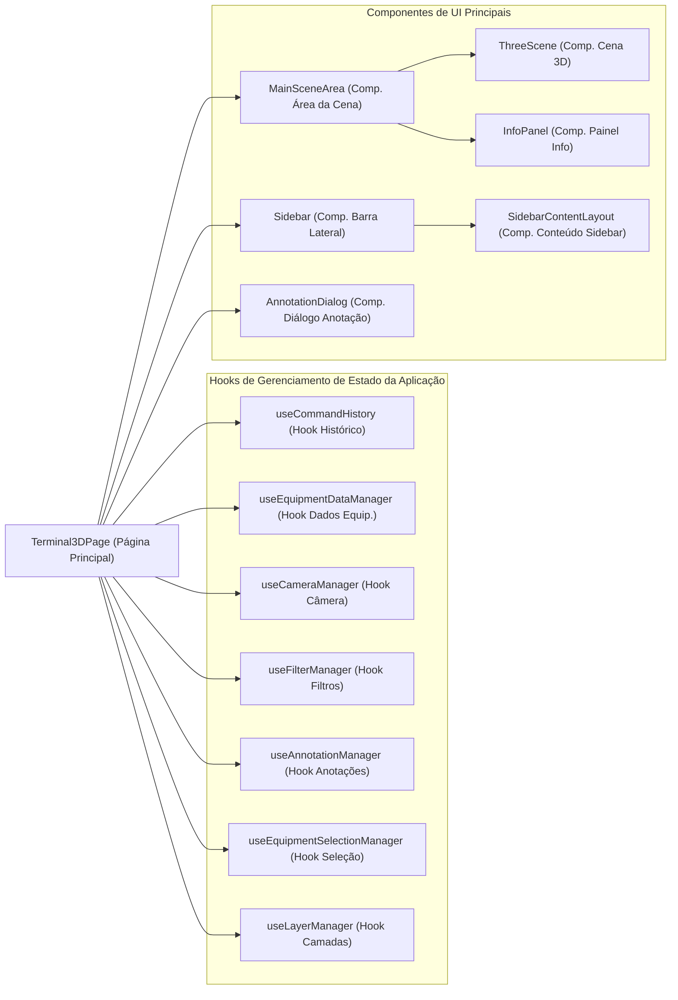

[**3D Terminal System API Documentation**](../../README.md)

***

[3D Terminal System API Documentation](../../README.md) / app/page

# app/page

## See

 - documentation/api/components/main-scene-area/README.md Para a área principal da cena.
 - documentation/api/components/ui/sidebar/README.md Para a barra lateral de controles.
 - documentation/api/components/annotation-dialog/README.md Para o diálogo de anotações.
 - documentation/api/hooks/use-command-history/README.md Para o gerenciamento de histórico de comandos.
 - documentation/api/hooks/use-equipment-data-manager/README.md Para o gerenciamento de dados de equipamentos.
 - documentation/api/hooks/use-camera-manager/README.md Para o gerenciamento da câmera.
 - documentation/api/hooks/use-filter-manager/README.md Para o gerenciamento de filtros.
 - documentation/api/hooks/use-annotation-manager/README.md Para o gerenciamento de anotações.
 - documentation/api/hooks/use-equipment-selection-manager/README.md Para o gerenciamento de seleção de equipamentos.
 - documentation/api/hooks/use-layer-manager/README.md Para o gerenciamento de camadas.

Diagrama de Interação de Alto Nível da Terminal3DPage:

## Functions

- [default](functions/default.md)
