[**3D Terminal System API Documentation**](../../README.md)

***

[3D Terminal System API Documentation](../../README.md) / components/three-scene

# components/three-scene

## See

 - documentation/api/hooks/use-scene-setup/README.md Para a orquestração da configuração da cena.
 - documentation/api/hooks/use-equipment-renderer/README.md Para a renderização de equipamentos.
 - documentation/api/hooks/use-annotation-pin-renderer/README.md Para a renderização de pins de anotação.
 - documentation/api/hooks/use-mouse-interaction/README.md Para interações do mouse.
 - documentation/api/hooks/use-scene-outline/README.md Para o efeito de contorno.
 - documentation/api/hooks/useAnimationLoop/README.md Para o loop de animação.

Diagrama de Composição do ThreeScene e seus Hooks:

```mermaid
graph TD
    ThreeScene_Comp["ThreeScene (Componente React)"]
    MountPoint["<div ref={mountRef}> (Ponto de Montagem DOM)"]

    ThreeScene_Comp -- renderiza --> MountPoint

    subgraph "Hooks Utilizados por ThreeScene"
        direction LR
        H_SceneSetup["useSceneSetup (Orquestrador de Setup)"]
        H_EquipRenderer["useEquipmentRenderer"]
        H_AnnotPinRenderer["useAnnotationPinRenderer"]
        H_MouseInt["useMouseInteractionManager"]
        H_Outline["useSceneOutline"]
        H_AnimLoop["useAnimationLoop"]
    end

    ThreeScene_Comp -- usa --> H_SceneSetup
    ThreeScene_Comp -- usa --> H_EquipRenderer
    ThreeScene_Comp -- usa --> H_AnnotPinRenderer
    ThreeScene_Comp -- usa --> H_MouseInt
    ThreeScene_Comp -- usa --> H_Outline
    ThreeScene_Comp -- usa --> H_AnimLoop

    H_SceneSetup --> R_Scene["sceneRef"]
    H_SceneSetup --> R_Camera["cameraRef"]
    H_SceneSetup --> R_Renderer["rendererRef"]
    H_SceneSetup --> R_LabelRenderer["labelRendererRef"]
    H_SceneSetup --> R_Controls["controlsRef"]
    H_SceneSetup --> R_Composer["composerRef"]
    H_SceneSetup --> R_OutlinePass["outlinePassRef"]
    H_SceneSetup --> F_IsSceneReady["isSceneReady (flag)"]
    H_SceneSetup --> F_IsControlsReady["isControlsReady (flag)"]

    H_EquipRenderer -- usa --> R_Scene
    H_AnnotPinRenderer -- usa --> R_Scene
    H_AnnotPinRenderer -- usa --> R_LabelRenderer
    H_MouseInt -- usa --> MountPoint
    H_MouseInt -- usa --> R_Camera
    H_Outline -- usa --> R_OutlinePass
    H_AnimLoop -- usa --> R_Scene
    H_AnimLoop -- usa --> R_Camera
    H_AnimLoop -- usa --> R_Controls
    H_AnimLoop -- usa --> R_Composer
    H_AnimLoop -- usa --> R_LabelRenderer

    classDef comp fill:#lightcoral,stroke:#333,stroke-width:2px;
    classDef hook fill:#lightblue,stroke:#333,stroke-width:2px;
    classDef ref fill:#lightgoldenrodyellow,stroke:#333,stroke-width:2px;
    classDef flag fill:#lightpink,stroke:#333,stroke-width:2px;

    class ThreeScene_Comp comp;
    class MountPoint comp;
    class H_SceneSetup,H_EquipRenderer,H_AnnotPinRenderer,H_MouseInt,H_Outline,H_AnimLoop hook;
    class R_Scene,R_Camera,R_Renderer,R_LabelRenderer,R_Controls,R_Composer,R_OutlinePass ref;
    class F_IsSceneReady,F_IsControlsReady flag;
```

## Interfaces

- [ThreeSceneProps](interfaces/ThreeSceneProps.md)

## Variables

- [default](variables/default.md)
