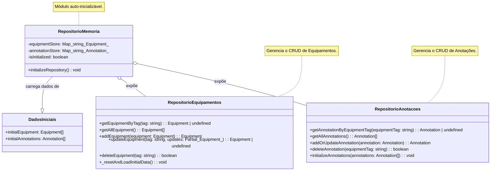

[**3D Terminal System API Documentation**](../../../README.md)

***

[3D Terminal System API Documentation](../../../README.md) / core/repository/memory-repository

# core/repository/memory-repository

## See

 - documentation/api/core/data/initial-data/README.md Para os dados iniciais de equipamentos e camadas.
 - documentation/api/lib/types/README.md#Equipment Para a interface de Equipamento.
 - documentation/api/lib/types/README.md#Annotation Para a interface de Anotação.

Diagrama de Estrutura do Repositório em Memória:

## Variables

- [annotationRepository](variables/annotationRepository.md)
- [equipmentRepository](variables/equipmentRepository.md)
