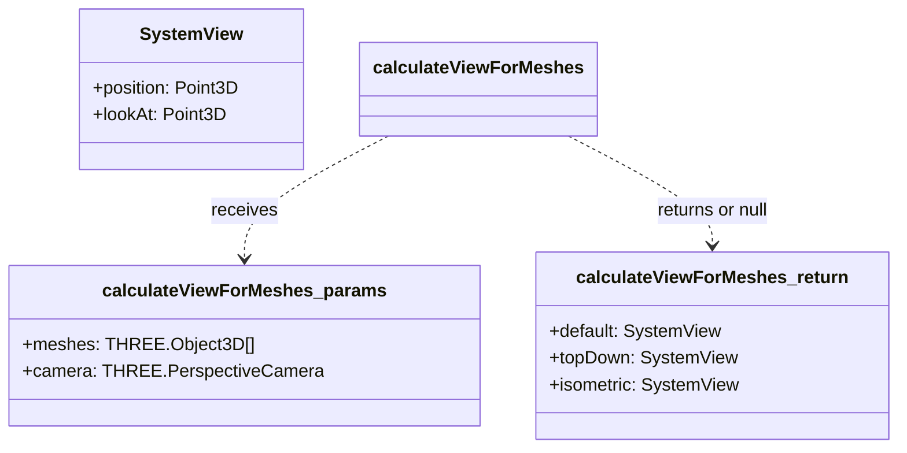

[**3D Terminal System API Documentation**](../../../README.md)

***

[3D Terminal System API Documentation](../../../README.md) / core/three/camera-utils

# core/three/camera-utils

## Example

## Functions

- [calculateViewForMeshes](functions/calculateViewForMeshes.md)
