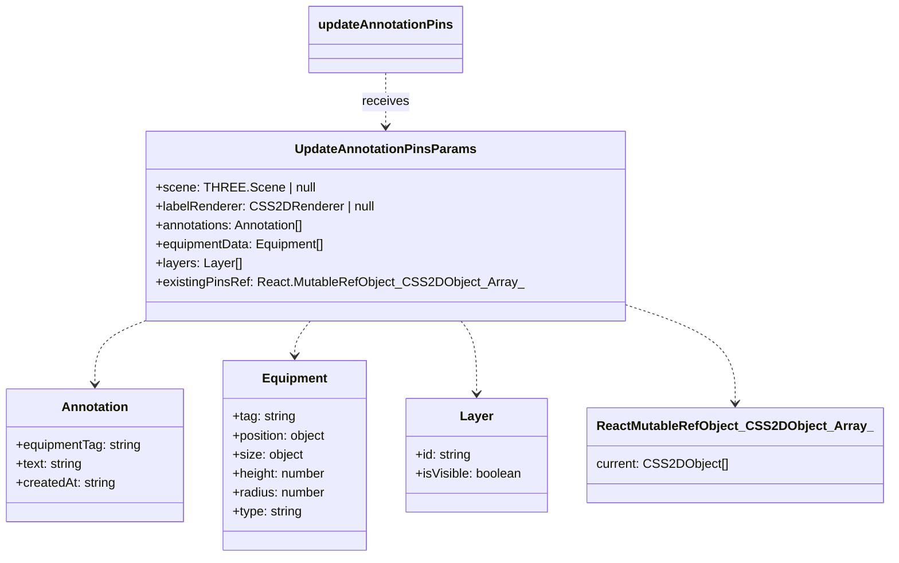

[**3D Terminal System API Documentation**](../../../README.md)

***

[3D Terminal System API Documentation](../../../README.md) / core/three/label-renderer-utils

# core/three/label-renderer-utils

## Example

Exporta:
- `updateLabelRendererSize`: Atualiza o tamanho do CSS2DRenderer.
- `updateAnnotationPins`: Gerencia os pins de anotação na cena.

## Interfaces

- [UpdateAnnotationPinsParams](interfaces/UpdateAnnotationPinsParams.md)

## Functions

- [updateAnnotationPins](functions/updateAnnotationPins.md)
- [updateLabelRendererSize](functions/updateLabelRendererSize.md)
