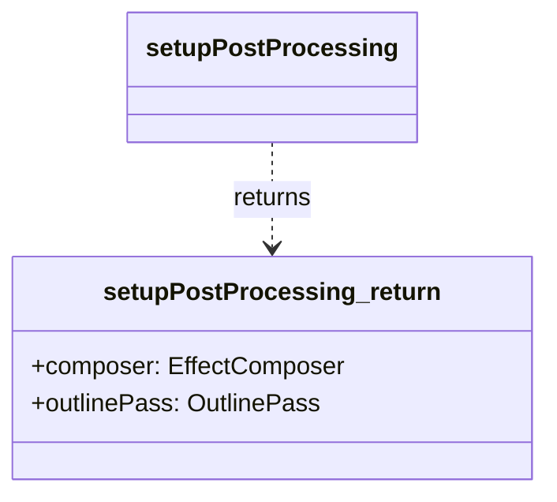

[**3D Terminal System API Documentation**](../../../README.md)

***

[3D Terminal System API Documentation](../../../README.md) / core/three/postprocessing-utils

# core/three/postprocessing-utils

## Example

Exporta:
- `setupPostProcessing`: Configura o pipeline inicial de pós-processamento.
- `updatePostProcessingSize`: Atualiza o tamanho do composer e do outline pass.
- `updateOutlineEffect`: Atualiza quais objetos são contornados e com qual estilo.

## Functions

- [setupPostProcessing](functions/setupPostProcessing.md)
- [updateOutlineEffect](functions/updateOutlineEffect.md)
- [updatePostProcessingSize](functions/updatePostProcessingSize.md)
