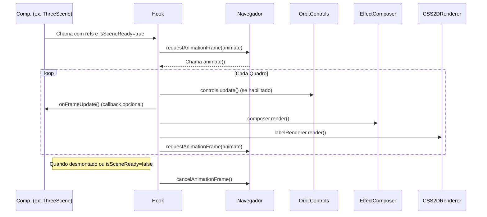

[**3D Terminal System API Documentation**](../../README.md)

***

[3D Terminal System API Documentation](../../README.md) / hooks/use-animation-loop

# hooks/use-animation-loop

## Param

Propriedades para configurar o loop de animação.

Diagrama de Fluxo do useAnimationLoop:

## Interfaces

- [UseAnimationLoopProps](interfaces/UseAnimationLoopProps.md)

## Functions

- [useAnimationLoop](functions/useAnimationLoop.md)
