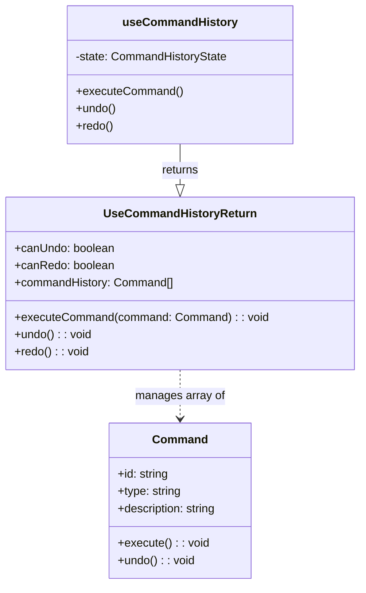

[**3D Terminal System API Documentation**](../../README.md)

***

[3D Terminal System API Documentation](../../README.md) / hooks/use-command-history

# hooks/use-command-history

## Example

## Interfaces

- [CommandHistoryState](interfaces/CommandHistoryState.md)
- [UseCommandHistoryReturn](interfaces/UseCommandHistoryReturn.md)

## Functions

- [useCommandHistory](functions/useCommandHistory.md)
