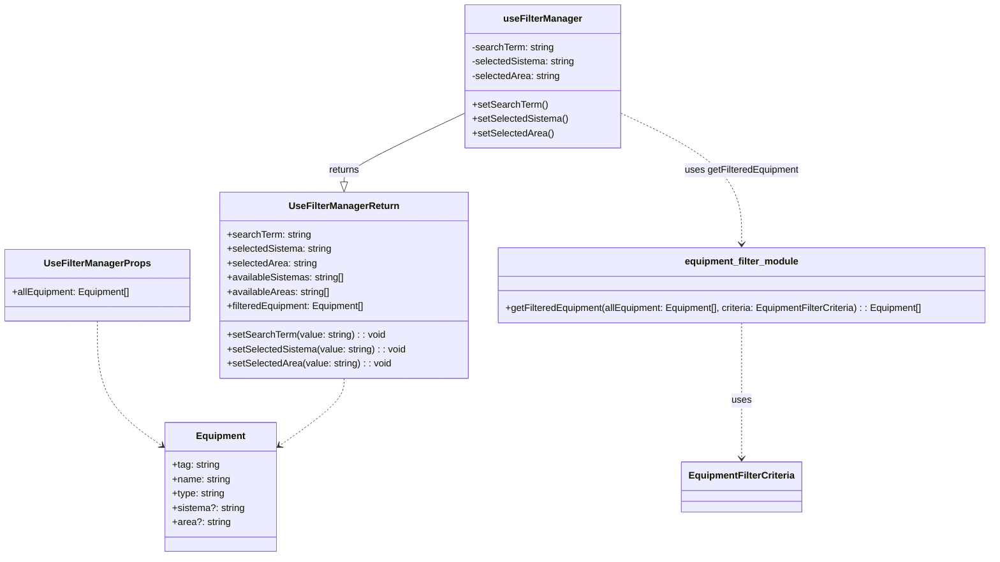

[**3D Terminal System API Documentation**](../../README.md)

***

[3D Terminal System API Documentation](../../README.md) / hooks/use-filter-manager

# hooks/use-filter-manager

## Example

## Interfaces

- [UseFilterManagerProps](interfaces/UseFilterManagerProps.md)
- [UseFilterManagerReturn](interfaces/UseFilterManagerReturn.md)

## Functions

- [useFilterManager](functions/useFilterManager.md)
