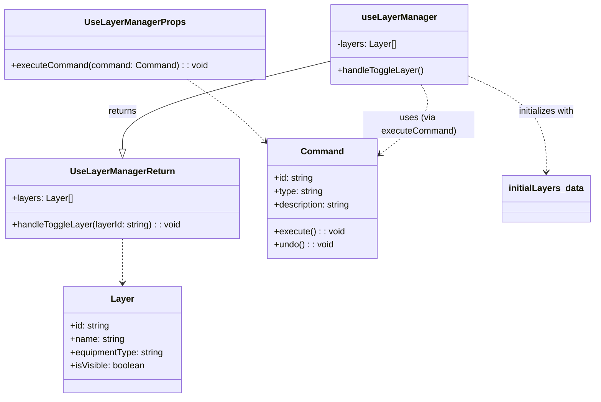

[**3D Terminal System API Documentation**](../../README.md)

***

[3D Terminal System API Documentation](../../README.md) / hooks/use-layer-manager

# hooks/use-layer-manager

## Example

## Interfaces

- [UseLayerManagerProps](interfaces/UseLayerManagerProps.md)
- [UseLayerManagerReturn](interfaces/UseLayerManagerReturn.md)

## Functions

- [useLayerManager](functions/useLayerManager.md)
