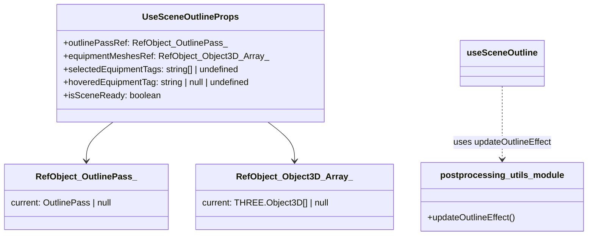

[**3D Terminal System API Documentation**](../../README.md)

***

[3D Terminal System API Documentation](../../README.md) / hooks/use-scene-outline

# hooks/use-scene-outline

## Example

## Interfaces

- [UseSceneOutlineProps](interfaces/UseSceneOutlineProps.md)

## Functions

- [useSceneOutline](functions/useSceneOutline.md)
