[**3D Terminal System API Documentation**](../../README.md)

***

[3D Terminal System API Documentation](../../README.md) / hooks/use-scene-setup

# hooks/use-scene-setup

## See

 - documentation/api/hooks/useThreeCore/README.md Para inicialização da cena e câmera.
 - documentation/api/hooks/useThreeRenderers/README.md Para configuração dos renderizadores e pós-processamento.
 - documentation/api/hooks/useThreeOrbitControls/README.md Para configuração dos controles de órbita.
 - documentation/api/hooks/useThreeSceneElements/README.md Para configuração de iluminação e plano de chão.
 - documentation/api/hooks/useThreeResize/README.md Para manipulação de redimensionamento.

Diagrama de Composição do useSceneSetup:

```mermaid
graph TD
    useSceneSetup_Orchestrator["useSceneSetup (Orquestrador)"]

    subgraph "Hooks Especializados de Setup"
        direction LR
        H_Core["useThreeCore"]
        H_Renderers["useThreeRenderers"]
        H_Controls["useThreeOrbitControls"]
        H_Elements["useThreeSceneElements"]
        H_Resize["useThreeResize"]
    end

    useSceneSetup_Orchestrator -- compõe --> H_Core
    useSceneSetup_Orchestrator -- compõe --> H_Renderers
    useSceneSetup_Orchestrator -- compõe --> H_Controls
    useSceneSetup_Orchestrator -- compõe --> H_Elements
    useSceneSetup_Orchestrator -- compõe --> H_Resize

    H_Core --> R_Scene["sceneRef"]
    H_Core --> R_Camera["cameraRef"]

    H_Renderers -- usa --> R_Scene
    H_Renderers -- usa --> R_Camera
    H_Renderers --> R_Renderer["rendererRef"]
    H_Renderers --> R_LabelRenderer["labelRendererRef"]
    H_Renderers --> R_Composer["composerRef"]
    H_Renderers --> R_OutlinePass["outlinePassRef"]
    H_Renderers --> F_RenderersReady["areRenderersReady (flag)"]

    H_Controls -- usa --> R_Camera
    H_Controls -- usa --> R_Renderer
    H_Controls --> R_OrbitControls["controlsRef"]
    H_Controls --> F_ControlsReady["isControlsReady (flag)"]

    H_Elements -- usa --> R_Scene
    H_Elements --> R_GroundMesh["groundMeshRef"]

    H_Resize -- usa --> R_Camera
    H_Resize -- usa --> R_Renderer
    H_Resize -- usa --> R_LabelRenderer
    H_Resize -- usa --> R_Composer
    H_Resize -- usa --> R_OutlinePass

    useSceneSetup_Orchestrator -- retorna --> R_Scene
    useSceneSetup_Orchestrator -- retorna --> R_Camera
    useSceneSetup_Orchestrator -- retorna --> R_Renderer
    useSceneSetup_Orchestrator -- retorna --> R_LabelRenderer
    useSceneSetup_Orchestrator -- retorna --> R_OrbitControls
    useSceneSetup_Orchestrator -- retorna --> R_Composer
    useSceneSetup_Orchestrator -- retorna --> R_OutlinePass
    useSceneSetup_Orchestrator -- retorna --> R_GroundMesh
    useSceneSetup_Orchestrator -- retorna --> F_SceneReady["isSceneReady (flag combinada)"]
    useSceneSetup_Orchestrator -- retorna --> F_ControlsReady

    classDef hook fill:#lightblue,stroke:#333,stroke-width:2px;
    classDef ref fill:#lightgoldenrodyellow,stroke:#333,stroke-width:2px;
    classDef flag fill:#lightpink,stroke:#333,stroke-width:2px;

    class useSceneSetup_Orchestrator hook;
    class H_Core,H_Renderers,H_Controls,H_Elements,H_Resize hook;
    class R_Scene,R_Camera,R_Renderer,R_LabelRenderer,R_OrbitControls,R_Composer,R_OutlinePass,R_GroundMesh ref;
    class F_RenderersReady,F_ControlsReady,F_SceneReady flag;
```

## Interfaces

- [UseSceneSetupProps](interfaces/UseSceneSetupProps.md)
- [UseSceneSetupReturn](interfaces/UseSceneSetupReturn.md)

## Functions

- [useSceneSetup](functions/useSceneSetup.md)
