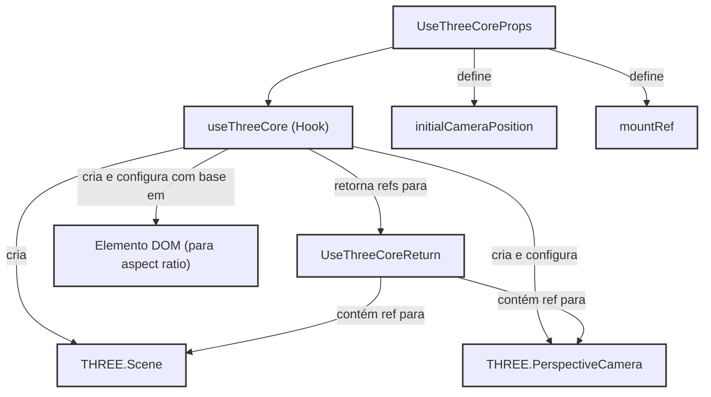

[**3D Terminal System API Documentation**](../../README.md)

***

[3D Terminal System API Documentation](../../README.md) / hooks/useThreeCore

# hooks/useThreeCore

## Example

## Interfaces

- [UseThreeCoreProps](interfaces/UseThreeCoreProps.md)
- [UseThreeCoreReturn](interfaces/UseThreeCoreReturn.md)

## Functions

- [useThreeCore](functions/useThreeCore.md)
