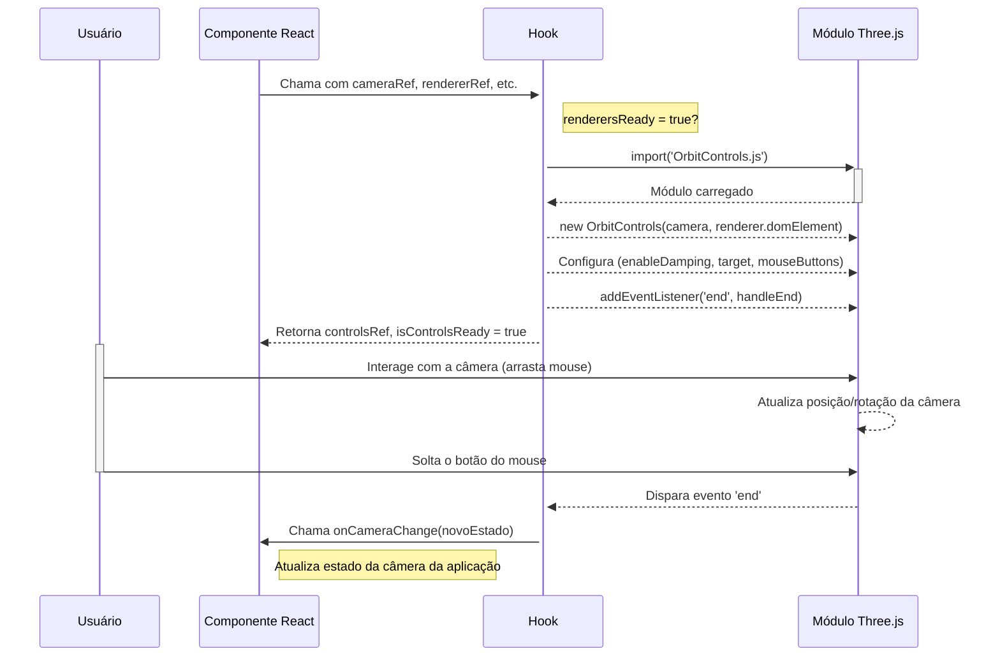

[**3D Terminal System API Documentation**](../../README.md)

***

[3D Terminal System API Documentation](../../README.md) / hooks/useThreeOrbitControls

# hooks/useThreeOrbitControls

## Example

## Interfaces

- [UseThreeOrbitControlsProps](interfaces/UseThreeOrbitControlsProps.md)
- [UseThreeOrbitControlsReturn](interfaces/UseThreeOrbitControlsReturn.md)

## Functions

- [useThreeOrbitControls](functions/useThreeOrbitControls.md)
