[**3D Terminal System API Documentation**](../../README.md)

***

[3D Terminal System API Documentation](../../README.md) / hooks/useThreeRenderers

# hooks/useThreeRenderers

## Example

```mermaid
graph TD
    useThreeRenderers["useThreeRenderers (Hook)"]
    Props["UseThreeRenderersProps"]
    Return["UseThreeRenderersReturn"]

    subgraph "Objetos Three.js Gerenciados"
        WebGLRenderer["THREE.WebGLRenderer"]
        CSS2DRenderer["THREE.CSS2DRenderer"]
        EffectComposer["THREE.EffectComposer"]
        RenderPass["THREE.RenderPass"]
        OutlinePass["THREE.OutlinePass"]
    end

    Props -- define --> PExistingSceneRef["sceneRef (existente)"]
    Props -- define --> PExistingCameraRef["cameraRef (existente)"]
    Props -- define --> PMountRef["mountRef (DOM)"]

    useThreeRenderers -- usa --> PExistingSceneRef
    useThreeRenderers -- usa --> PExistingCameraRef
    useThreeRenderers -- anexa ao --> PMountRef

    useThreeRenderers -- cria e configura --> WebGLRenderer
    useThreeRenderers -- cria e configura --> CSS2DRenderer
    useThreeRenderers -- cria e configura --> EffectComposer
    EffectComposer -- contém --> RenderPass
    EffectComposer -- contém --> OutlinePass

    Return -- contém ref para --> WebGLRenderer
    Return -- contém ref para --> CSS2DRenderer
    Return -- contém ref para --> EffectComposer
    Return -- contém ref para --> OutlinePass
    Return -- contém --> FAreRenderersReady["areRenderersReady (flag)"]

    classDef hook fill:#lightblue,stroke:#333,stroke-width:2px;
    classDef type fill:#lightgoldenrodyellow,stroke:#333,stroke-width:2px;
    classDef obj3d fill:#lightgreen,stroke:#333,stroke-width:2px;
    classDef dom fill:#lightcoral,stroke:#333,stroke-width:2px;
    classDef flag fill:#lightpink,stroke:#333,stroke-width:2px;

    class useThreeRenderers hook;
    class Props,Return,PExistingSceneRef,PExistingCameraRef,PMountRef type;
    class WebGLRenderer,CSS2DRenderer,EffectComposer,RenderPass,OutlinePass obj3d;
    class FAreRenderersReady flag;
```

## Interfaces

- [UseThreeRenderersProps](interfaces/UseThreeRenderersProps.md)
- [UseThreeRenderersReturn](interfaces/UseThreeRenderersReturn.md)

## Functions

- [useThreeRenderers](functions/useThreeRenderers.md)
