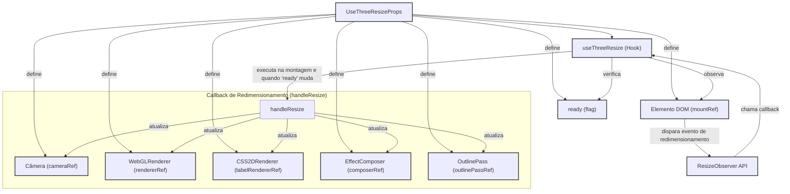

[**3D Terminal System API Documentation**](../../README.md)

***

[3D Terminal System API Documentation](../../README.md) / hooks/useThreeResize

# hooks/useThreeResize

## Param

Objeto contendo refs para os elementos Three.js que precisam ser redimensionados e uma flag de prontidão.

## Example

## Interfaces

- [UseThreeResizeProps](interfaces/UseThreeResizeProps.md)

## Functions

- [useThreeResize](functions/useThreeResize.md)
