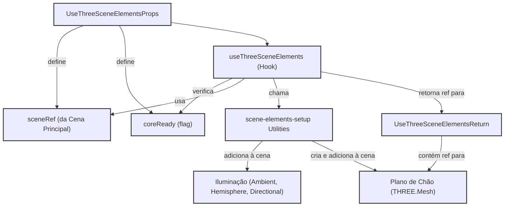

[**3D Terminal System API Documentation**](../../README.md)

***

[3D Terminal System API Documentation](../../README.md) / hooks/useThreeSceneElements

# hooks/useThreeSceneElements

## See

 - documentation/api/core/three/scene-elements-setup/README.md#setupLighting Para a função de configuração da iluminação.
 - documentation/api/core/three/scene-elements-setup/README.md#setupGroundPlane Para a função de configuração do plano de chão.

Diagrama de Funcionalidade do useThreeSceneElements:

## Interfaces

- [UseThreeSceneElementsProps](interfaces/UseThreeSceneElementsProps.md)
- [UseThreeSceneElementsReturn](interfaces/UseThreeSceneElementsReturn.md)

## Functions

- [useThreeSceneElements](functions/useThreeSceneElements.md)
