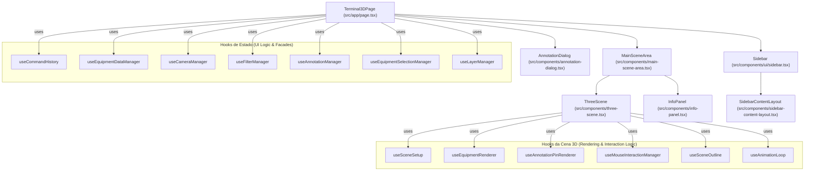
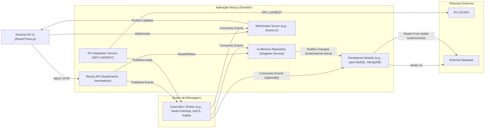
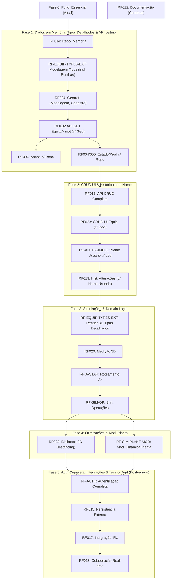

# Arquitetura e Requisitos de Software - Terminal 3D

Este documento detalha a arquitetura do sistema Terminal 3D, requisitos funcionais, não funcionais e as tecnologias utilizadas.

## 1. Visão Geral do Sistema

O sistema Terminal 3D visa fornecer uma visualização interativa em três dimensões de um terminal industrial (portuário, de mineração, etc.), permitindo aos usuários monitorar equipamentos, seus estados operacionais, produtos associados, adicionar anotações textuais e controlar a visualização da cena através de filtros e camadas. A arquitetura evoluirá para suportar persistência de dados, integração com sistemas externos como o iFix, colaboração em tempo real, e funcionalidades avançadas de simulação e análise.

## 2. Requisitos Funcionais (RF) Existentes

-   **RF001**: O sistema deve exibir uma cena 3D representando o terminal e seus equipamentos. `[IMPLEMENTADO]`
-   **RF002**: O sistema deve permitir a navegação (zoom, pan, órbita) na cena 3D. `[IMPLEMENTADO]`
-   **RF003**: O sistema deve exibir informações detalhadas de um equipamento ao ser selecionado. `[IMPLEMENTADO]`
    -   **RF003.1**: As informações devem incluir nome, TAG, tipo, sistema, área, estado operacional, produto e detalhes textuais. `[IMPLEMENTADO]`
-   **RF004**: O sistema deve permitir a alteração do estado operacional de um equipamento. `[IMPLEMENTADO, refatorar para novo repositório]`
-   **RF005**: O sistema deve permitir a alteração do produto associado a um equipamento (quando aplicável). `[IMPLEMENTADO, refatorar para novo repositório]`
-   **RF006**: O sistema deve permitir a adição, edição e remoção de anotações textuais para cada equipamento. `[IMPLEMENTADO, refatorar para novo repositório]`
    -   **RF006.1**: Cada anotação deve registrar a data de criação/modificação. `[IMPLEMENTADO, refatorar para novo repositório]`
-   **RF007**: O sistema deve permitir filtrar os equipamentos exibidos por: `[IMPLEMENTADO]`
    -   **RF007.1**: Termo de busca (nome, TAG, tipo). `[IMPLEMENTADO]`
    -   **RF007.2**: Sistema. `[IMPLEMENTADO]`
    -   **RF007.3**: Área. `[IMPLEMENTADO]`
-   **RF008**: O sistema deve permitir o controle de visibilidade de diferentes camadas de objetos (e.g., prédios, tanques, tubulações, anotações, terreno). `[IMPLEMENTADO]`
-   **RF009**: O sistema deve permitir colorir os equipamentos na cena 3D com base em: `[IMPLEMENTADO]`
    -   **RF009.1**: Cor base do equipamento. `[IMPLEMENTADO]`
    -   **RF009.2**: Estado operacional. `[IMPLEMENTADO]`
    -   **RF009.3**: Produto. `[IMPLEMENTADO]`
-   **RF010**: O sistema deve permitir focar a câmera em um sistema específico, enquadrando todos os equipamentos daquele sistema. `[IMPLEMENTADO]`
-   **RF011**: O sistema deve manter um histórico de comandos para ações que alteram o estado (e.g., seleção, mudança de câmera, visibilidade de camada), permitindo operações de "Desfazer" (Undo) e "Refazer" (Redo). `[IMPLEMENTADO]`
    -   **RF011.1**: As alterações de estado operacional e produto não são, por padrão, parte do histórico de undo/redo, pois representam modificações diretas nos dados "reais". `[IMPLEMENTADO]`
    -   **RF011.2**: A criação, edição ou exclusão de anotações também não fazem parte do histórico de undo/redo, pois são persistidas diretamente. `[IMPLEMENTADO]`
-   **RF012**: O sistema deve gerar e manter automaticamente a documentação técnica (API, arquitetura, fluxos) e diagrama de classes a partir do código-fonte e comentários, usando ferramentas open-source. `[EM ANDAMENTO]`
-   **RF013**: A documentação gerada deve ser acessível através de um link na interface do sistema. `[IMPLEMENTADO]`

## 2.1. Novos Requisitos Funcionais (RF) Propostos

| Código             | Descrição                                                                                                                                                                                                                                                                                                                                                     | Prioridade/Fase Sugerida |
| ------------------ | ------------------------------------------------------------------------------------------------------------------------------------------------------------------------------------------------------------------------------------------------------------------------------------------------------------------------------------------------------------- | ------------------------ |
| **RF014**          | **Banco de dados em memória:** O sistema deve manter, durante a execução, todos os dados de equipamentos, atributos e anotações em um banco de dados em memória (e.g. um repositório JavaScript ou um serviço in-process), garantindo CRUD completo (criar, ler, atualizar, excluir).                                                                    | Fase 2                   |
| **RF-EQUIP-TYPES-EXT** | **Extensão dos tipos de equipamentos (Modelagem Inicial):** Definir interfaces e atributos para:   - Tanque (com `tankType`: 'teto-fixo', 'teto-flutuante-externo', 'teto-flutuante-interno')   - Esfera (usa `radius`)   - Vaso (com `orientation`: 'vertical', 'horizontal', usa `radius`, `height`)   - Tubulação (com `material`)   - Bomba (com `pumpType`: 'centrifuga', 'deslocamento-positivo'; `motorDetails`: { `potenciaCv`, `tensao` })   - Válvulas (com `valveMechanism`: 'gaveta', 'esfera', 'controle'; `actuationType`: 'manual', 'motorizada')   - Navio (com `capacityDwt`, usa `size`)   - Barcaça (com `capacityDwt`, usa `size`)   - Prédio (usa `size`). `[IMPLEMENTADO PARCIALMENTE - MODELAGEM]` | Fase 2                   |
| **RF024**          | **Georreferenciamento (Modelagem e Cadastro Inicial):** Adicionar campos WGS84 aos equipamentos. Permitir captura de geolocalização no cadastro (via móvel) e visualização no InfoPanel.                                                                                                                                                                     | Fase 2                   |
| **RF016**          | **API HTTP REST (Leitura Inicial):** Endpoints `GET /equipments`, `GET /equipments/:id` (incluindo geo), `GET /annotations`, `GET /annotations/:equipmentTag`.                                                                                                                                                                                            | Fase 2                   |
| **RF-AUTH-SIMPLE** | **Identificação Simples do Usuário:** Permitir que o usuário insira seu nome (persistido localmente/sessão) para uso no log de auditoria.                                                                                                                                                                                                                       | Fase 3                   |
| **RF016 (ext)**    | **API HTTP REST (CRUD Completo):** Endpoints `POST`, `PUT`, `DELETE` para equipamentos e anotações.                                                                                                                                                                                                                                                           | Fase 3                   |
| **RF023**          | **CRUD de equipamentos via UI:** Formulários para incluir, editar e excluir equipamentos, utilizando a API REST e permitindo definir geolocalização.                                                                                                                                                                                                         | Fase 3                   |
| **RF019**          | **Histórico de alterações de dados (com Nome do Usuário):** Log de auditoria com "nome do usuário", timestamp, campo alterado, valor anterior/novo. Consultável na UI de detalhes.                                                                                                                                                                            | Fase 3                   |
| **RF-EQUIP-TYPES-EXT (Render)** | **Extensão dos tipos de equipamentos (Renderização 3D):** Implementar a renderização 3D distinta para os novos tipos de equipamentos.                                                                                                                                                                                                               | Fase 4                   |
| **RF020**          | **Ferramenta de medição 3D:** Modo "Medir" para desenhar linhas/regiões, calcular distância, perímetro e volume total de equipamentos selecionados.                                                                                                                                                                                                             | Fase 4                   |
| **RF-A-STAR**      | **Algoritmo A\* para rotas:** Implementação de algoritmo (e.g. A\*) para cálculo e sugestão de rotas de alinhamento de produtos (pode exigir atributos de conexão nos equipamentos).                                                                                                                                                                              | Fase 4                   |
| **RF-SIM-OP**      | **Simulação de operações:** Simular visualmente operações como fluxo de produto entre tanques, efeito visual na UI.                                                                                                                                                                                                                                           | Fase 4                   |
| **RF022**          | **Biblioteca de objetos 3D compartilhada:** Otimizar uso de memória e payload armazenando parâmetros geométricos e reutilizando instâncias de meshes (InstancedMesh).                                                                                                                                                                                          | Fase 5                   |
| **RF-SIM-PLANT-MOD** | **Simulação de modificações na planta:** Permitir adicionar/remover/mover equipamentos dinamicamente via UI ou API, com impacto visual na cena 3D.                                                                                                                                                                                                          | Fase 5                   |
| **RF-AUTH**        | **Autenticação e Autorização (Completa):** Implementar sistema completo de login e gerenciamento de permissões de usuários.                                                                                                                                                                                                                                 | Fase 6                   |
| **RF015**          | **Persistência futura:** Módulo de persistência que serialize periodicamente o estado em memória para um banco de dados externo (Relacional ou NoSQL) via API REST.                                                                                                                                                                                           | Fase 6                   |
| **RF017**          | **Integração com iFix:** Consumir dados de equipamentos do iFix (OPC-UA ou API REST) em background, atualizando o repositório em memória via Event Bus.                                                                                                                                                                                                        | Fase 6                   |
| **RF018**          | **Colaboração em tempo real:** Propagação de alterações (seleção, filtros, atributos, anotações) a outros usuários conectados em tempo real (WebSocket/WebRTC) via Event Bus, refletindo estado global.                                                                                                                                                         | Fase 6                   |

## 3. Requisitos Não Funcionais (RNF)

-   **RNF001**: **Desempenho**: A renderização da cena 3D deve ser fluida, com uma taxa de quadros aceitável (mínimo 30 FPS) em hardware moderno.
-   **RNF002**: **Usabilidade**: A interface do usuário deve ser intuitiva e fácil de usar.
-   **RNF003**: **Manutenibilidade**: O código deve ser bem organizado, modularizado, comentado e seguir boas práticas de desenvolvimento para facilitar futuras manutenções e evoluções.
-   **RNF004**: **Portabilidade**: A aplicação deve ser acessível via navegador web moderno (Chrome, Firefox, Edge, Safari).
-   **RNF005**: **Confiabilidade**: O sistema deve ser estável e não apresentar falhas frequentes.
-   **RNF006**: **Extensibilidade**: A arquitetura deve permitir a fácil adição de novos tipos de equipamentos ou funcionalidades.
-   **RNF007**: **Segurança**: Com a introdução de RF-AUTH, a segurança de autenticação, autorização e proteção de dados se torna um requisito.

## 4. Arquitetura de Software

O sistema é uma aplicação web Single Page Application (SPA) construída com Next.js (React). A visualização 3D é implementada com Three.js. A arquitetura prioriza a separação de responsabilidades através de componentes de UI, hooks customizados para gerenciamento de estado e lógica de negócios, e módulos utilitários para funcionalidades core. Com a evolução, incluirá uma camada de API, um repositório de dados em memória, e potencialmente um Event Bus para integrações e tempo real.

### 4.1. Componentes Principais (Pós-Refatoração Inicial)

1.  **`Terminal3DPage` (`src/app/page.tsx`)**:
    *   Componente principal da página.
    *   Orquestra os diversos hooks de gerenciamento de estado de alto nível.
    *   Renderiza a `MainSceneArea`, `Sidebar` e `AnnotationDialog`.
    *   Gerencia estados locais da UI (e.g., modo de colorização) e lógicas que coordenam múltiplos hooks.

2.  **Hooks de Gerenciamento de Estado de Alto Nível (`src/hooks/`)**:
    *   **`useCommandHistory`**: Gerencia o histórico de comandos para Undo/Redo (ações de UI).
    *   **`useEquipmentDataManager`**: (A ser refatorado para usar o Repositório em Memória) "Fonte da verdade" para os dados dos equipamentos e suas modificações diretas (estado operacional, produto).
    *   **`useCameraManager`**: Gerencia o estado da câmera 3D (posição, lookAt, foco em sistemas), integrando com `useCommandHistory`.
    *   **`useFilterManager`**: Gerencia os critérios de filtro (busca, sistema, área) e a lista de equipamentos filtrados.
    *   **`useAnnotationManager`**: (A ser refatorado para usar o Repositório em Memória e API) Gerencia o estado das anotações (CRUD, estado do diálogo de edição).
    *   **`useEquipmentSelectionManager`**: Gerencia a seleção de equipamentos (single, multi, hover), integrando com `useCommandHistory`.
    *   **`useLayerManager`**: Gerencia a visibilidade das camadas da cena, integrando com `useCommandHistory`.

3.  **Componentes da Cena 3D (`src/components/`)**:
    *   **`MainSceneArea`**: Contêiner de layout para `ThreeScene` e `InfoPanel`. Passa os dados e callbacks necessários.
    *   **`ThreeScene`**: Componente React que orquestra a renderização e interação com a cena Three.js.
        *   Utiliza `useSceneSetup` para a infraestrutura básica da cena.
        *   Utiliza `useEquipmentRenderer` para gerenciar os meshes dos equipamentos.
        *   Utiliza `useAnnotationPinRenderer` para gerenciar os pins de anotação.
        *   Utiliza `useMouseInteractionManager` para processar interações do mouse.
        *   Utiliza `useSceneOutline` para aplicar efeitos de contorno.
        *   Utiliza `useAnimationLoop` para o loop de renderização.
    *   **`InfoPanel`**: Exibe detalhes do equipamento selecionado e permite interações.
    *   **`AnnotationDialog`**: Diálogo modal para adicionar/editar anotações textuais.

4.  **Componentes da Sidebar (`src/components/`, `src/components/ui/`)**:
    *   Estrutura da sidebar e seu conteúdo (`SidebarContentLayout`).

5.  **Lógica Core (`src/core/`)**:
    *   Dados iniciais, utilitários gráficos, lógica de filtro, utilitários Three.js.

6.  **Camada de Repositório (Novo - RF014)**:
    *   Módulo responsável por gerenciar os dados em memória (equipamentos, anotações).
    *   Exporá uma interface CRUD clara.

7.  **Camada de API (Novo - RF016)**:
    *   Next.js API Routes para expor endpoints RESTful.
    *   Interage com a Camada de Repositório.

8.  **Módulo de Integração iFix (Futuro - RF017)**:
    *   Serviço para comunicação com o iFix.

9.  **Event Bus e Servidor WebSocket (Futuro - RF017, RF018)**:
    *   Para distribuição de eventos e colaboração em tempo real.

10. **Módulo de Persistência (Futuro - RF015)**:
    *   Para salvar e carregar dados de um banco de dados externo.

### 4.2. Fluxo de Dados e Interações (Exemplos Revisados)

*   **Leitura de Equipamentos (Pós RF014 e RF016-GET):**
    1.  `Terminal3DPage` (ou um hook de dados de alto nível) faz uma chamada à API `GET /equipments`.
    2.  A API Route lê do Repositório em Memória e retorna os dados.
    3.  Os dados são passados para os hooks e componentes relevantes (`useFilterManager`, `ThreeScene`, etc.).

*   **Alteração de Estado Operacional (Pós RF014 e RF016-PUT):**
    1.  Usuário altera estado no `InfoPanel`.
    2.  Callback chama uma função (e.g., em `useEquipmentDataManager` ou diretamente).
    3.  Essa função faz uma chamada `PUT /equipments/:id` para a API.
    4.  A API Route atualiza o Repositório em Memória.
    5.  Se houver Event Bus/WebSocket (RF018), a alteração é propagada.
    6.  A UI é atualizada (otimisticamente ou após confirmação da API).

### 4.3. Diagrama de Componentes e Hooks de Alto Nível (Atual)

### 4.4. Proposta de Arquitetura de Comunicação Futura

O diagrama abaixo ilustra a arquitetura de comunicação proposta para suportar persistência, integração com iFix e colaboração em tempo real.

**Componentes da Arquitetura de Comunicação:**

*   **Repositório em Memória:** Inicialmente, a única fonte da verdade durante a execução. Padrão Repository isolado por interface.
*   **Camada de API (Next.js API Routes):** Expõe endpoints REST para CRUD. Recebe chamadas da UI e lê/escreve no repositório em memória. Publica eventos de alteração no Event Bus.
*   **Integração iFix:** Serviço de background conectado ao iFix (via OPC-UA client ou REST). Publica atualizações de dados do iFix no Event Bus.
*   **Event Bus:** Distribui eventos de dados (estados, volumes, alterações) para:
    *   Repositório em memória (para atualizar seu estado com dados do iFix ou outras fontes).
    *   Servidor WebSocket (para notificar clientes conectados sobre alterações).
    *   Opcionalmente, o Módulo de Persistência (para acionar persistência baseada em eventos).
*   **Servidor WebSocket:** Conecta-se à UI (Terminal 3D) para propagação de mudanças em tempo real, permitindo colaboração.
*   **Módulo de Persistência:** Observa mudanças no repositório em memória (diretamente ou via Event Bus) e persiste os dados periodicamente ou em resposta a eventos para um banco de dados externo. Também pode ser responsável por carregar dados do banco externo na inicialização.

### 4.5. Fases de Desenvolvimento Propostas (Alto Nível)

A implementação dos novos requisitos pode ser dividida nas seguintes fases, focando em construir uma base sólida e adicionar complexidade incrementalmente:

Com esses novos requisitos e a arquitetura proposta, o Terminal 3D ganha camadas claras para gerenciamento de dados em memória, persistência futura, comunicação robusta com sistemas externos como o iFix, e suporte a colaboração e histórico detalhado.

## 5. Tecnologias Utilizadas (Existente e Propostas)

*   **Frontend Framework**: Next.js (v15.x) com React (v18.x)
*   **Linguagem**: TypeScript
*   **Renderização 3D**: Three.js
*   **Componentes UI**: ShadCN UI
*   **Estilização**: Tailwind CSS
*   **Geração de Documentação**: TypeDoc com `typedoc-plugin-markdown` e `typedoc-plugin-mermaid`.
*   **Controle de Versão**: Git
*   **Gerenciador de Pacotes**: npm
*   **API Backend**: Next.js API Routes (inicialmente)
*   **Comunicação em Tempo Real (Proposto)**: WebSockets (e.g., Socket.io)
*   **Event Bus/Broker (Proposto)**: Redis Pub/Sub, NATS, ou Kafka (dependendo da escala)
*   **Banco de Dados de Persistência (Proposto)**: PostgreSQL, MySQL, MongoDB (a definir)
*   **Integração iFix (Proposto)**: OPC-UA client library (e.g., `node-opcua`) ou chamadas REST para API do iFix.

## 6. Documentação da API

A documentação detalhada da API, gerada a partir dos comentários do código-fonte, pode ser encontrada em: `documentation/api/README.md`. (Nota: Link relativo ao repositório).

